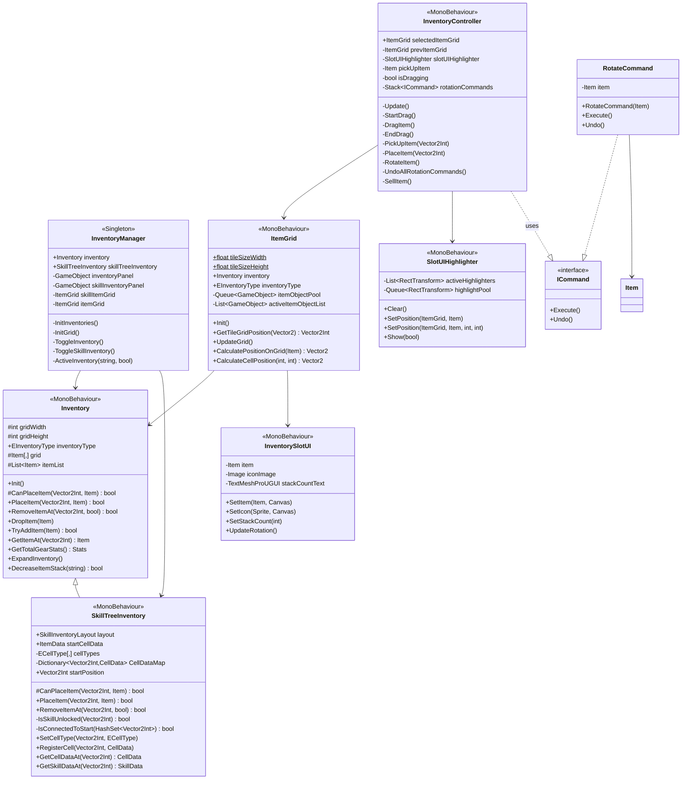
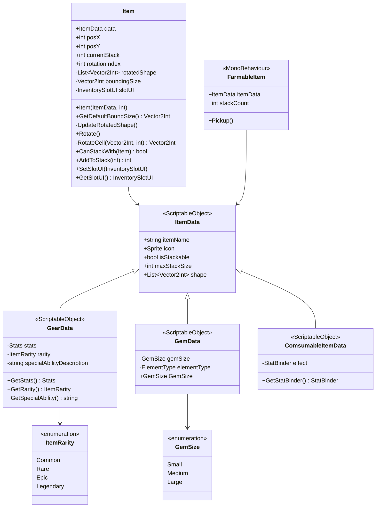
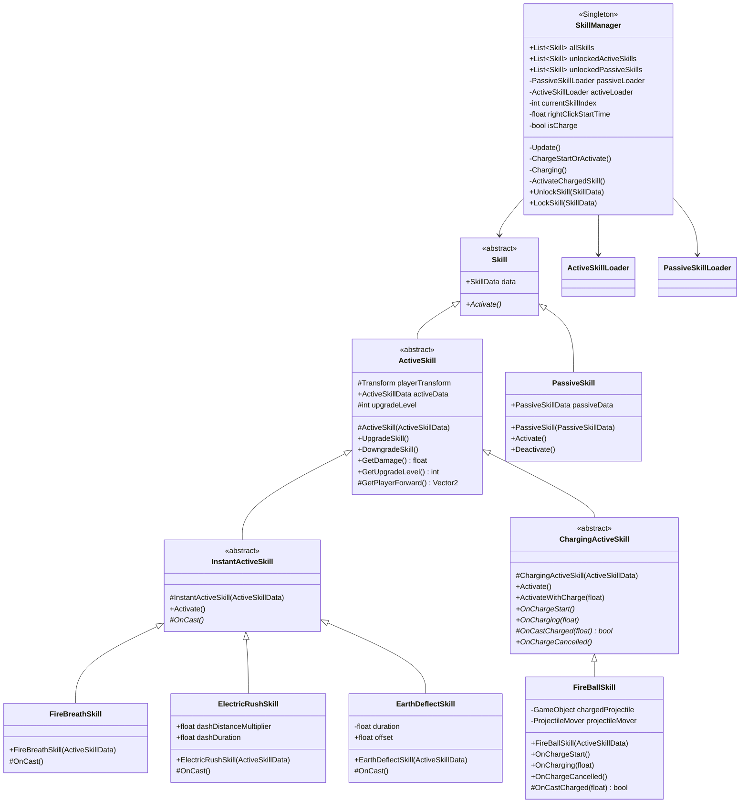
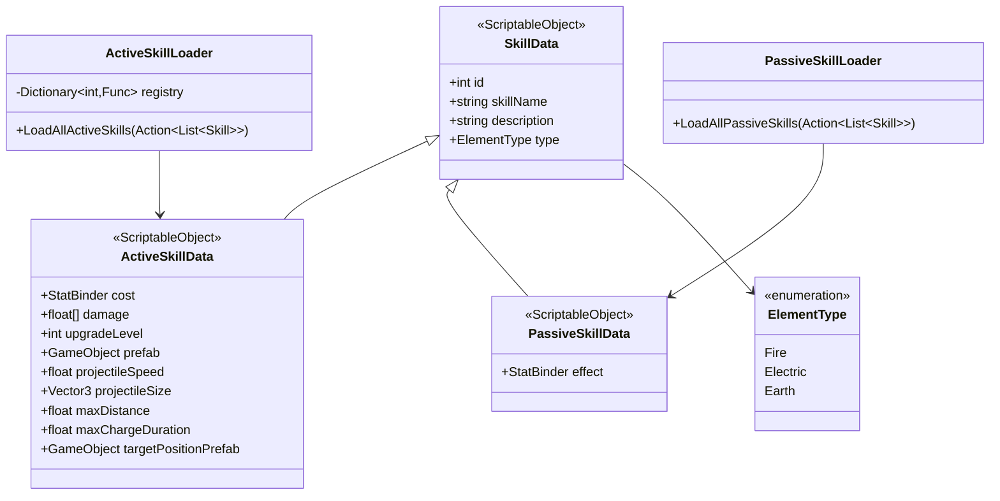
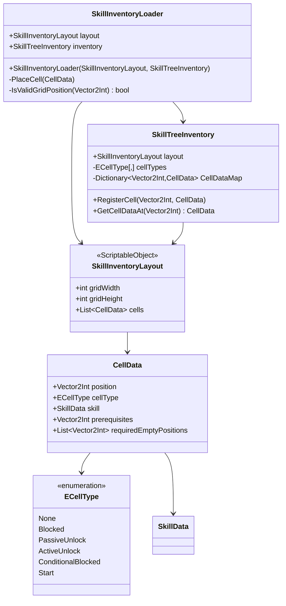
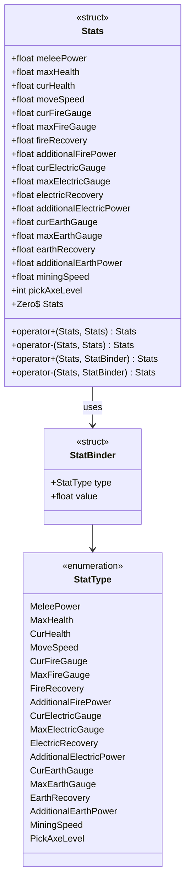
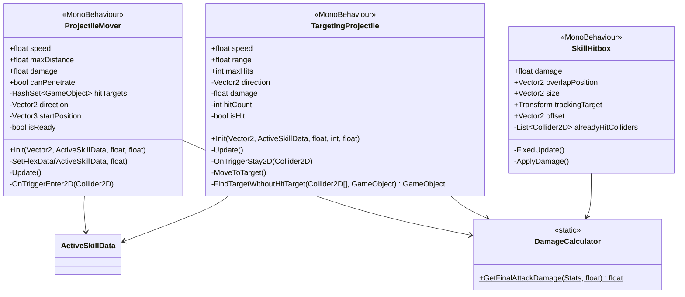

# 📐 클래스 다이어그램

## 1. 인벤토리 시스템 클래스 다이어그램

```mermaid
classDiagram
    direction TB
    
    class Inventory {
        <<MonoBehaviour>>
        #int gridWidth
        #int gridHeight
        +EInventoryType inventoryType
        #Item[,] grid
        #List~Item~ itemList
        +Init()
        #CanPlaceItem(Vector2Int, Item) bool
        +PlaceItem(Vector2Int, Item) bool
        +RemoveItemAt(Vector2Int, bool) bool
        +DropItem(Item)
        +TryAddItem(Item) bool
        +GetItemAt(Vector2Int) Item
        +GetTotalGearStats() Stats
        +ExpandInventory()
        +DecreaseItemStack(string) bool
    }
    
    class SkillTreeInventory {
        <<MonoBehaviour>>
        +SkillInventoryLayout layout
        +ItemData startCellData
        -ECellType[,] cellTypes
        -Dictionary~Vector2Int,CellData~ CellDataMap
        +Vector2Int startPosition
        #CanPlaceItem(Vector2Int, Item) bool
        +PlaceItem(Vector2Int, Item) bool
        +RemoveItemAt(Vector2Int, bool) bool
        -IsSkillUnlocked(Vector2Int) bool
        -IsConnectedToStart(HashSet~Vector2Int~) bool
        +SetCellType(Vector2Int, ECellType)
        +RegisterCell(Vector2Int, CellData)
        +GetCellDataAt(Vector2Int) CellData
        +GetSkillDataAt(Vector2Int) SkillData
    }
    
    class InventoryManager {
        <<Singleton>>
        +Inventory inventory
        +SkillTreeInventory skillTreeInventory
        -GameObject inventoryPanel
        -GameObject skillInventoryPanel
        -ItemGrid skillItemGrid
        -ItemGrid itemGrid
        -InitInventories()
        -InitGrid()
        -ToggleInventory()
        -ToggleSkillInventory()
        -ActiveInventory(string, bool)
    }
    
    class InventoryController {
        <<MonoBehaviour>>
        +ItemGrid selectedItemGrid
        -ItemGrid prevItemGrid
        -SlotUIHighlighter slotUIHighlighter
        -Item pickUpItem
        -bool isDragging
        -Stack~ICommand~ rotationCommands
        -Update()
        -StartDrag()
        -DragItem()
        -EndDrag()
        -PickUpItem(Vector2Int)
        -PlaceItem(Vector2Int)
        -RotateItem()
        -UndoAllRotationCommands()
        -SellItem()
    }
    
    class ItemGrid {
        <<MonoBehaviour>>
        +float tileSizeWidth$
        +float tileSizeHeight$
        +Inventory inventory
        +EInventoryType inventoryType
        -Queue~GameObject~ itemObjectPool
        -List~GameObject~ activeItemObjectList
        +Init()
        +GetTileGridPosition(Vector2) Vector2Int
        +UpdateGrid()
        +CalculatePositionOnGrid(Item) Vector2
        +CalculateCellPosition(int, int) Vector2
    }
    
    class ICommand {
        <<interface>>
        +Execute()
        +Undo()
    }
    
    class RotateCommand {
        -Item item
        +RotateCommand(Item)
        +Execute()
        +Undo()
    }
    
    class SlotUIHighlighter {
        <<MonoBehaviour>>
        -List~RectTransform~ activeHighlighters
        -Queue~RectTransform~ highlightPool
        +Clear()
        +SetPosition(ItemGrid, Item)
        +SetPosition(ItemGrid, Item, int, int)
        +Show(bool)
    }
    
    class InventorySlotUI {
        <<MonoBehaviour>>
        -Item item
        -Image iconImage
        -TextMeshProUGUI stackCountText
        +SetItem(Item, Canvas)
        +SetIcon(Sprite, Canvas)
        +SetStackCount(int)
        +UpdateRotation()
    }
    
    Inventory <|-- SkillTreeInventory
    InventoryManager --> Inventory
    InventoryManager --> SkillTreeInventory
    InventoryController --> ItemGrid
    InventoryController --> SlotUIHighlighter
    InventoryController ..|> ICommand : uses
    ItemGrid --> Inventory
    ItemGrid --> InventorySlotUI
    RotateCommand ..|> ICommand
    RotateCommand --> Item
```

## 2. 아이템 시스템 클래스 다이어그램

```mermaid
classDiagram
    direction TB
    
    class Item {
        +ItemData data
        +int posX
        +int posY
        +int currentStack
        +int rotationIndex
        -List~Vector2Int~ rotatedShape
        -Vector2Int boundingSize
        -InventorySlotUI slotUI
        +Item(ItemData, int)
        +GetDefaultBoundSize() Vector2Int
        -UpdateRotatedShape()
        +Rotate()
        -RotateCell(Vector2Int, int) Vector2Int
        +CanStackWith(Item) bool
        +AddToStack(int) int
        +SetSlotUI(InventorySlotUI)
        +GetSlotUI() InventorySlotUI
    }
    
    class ItemData {
        <<ScriptableObject>>
        +string itemName
        +Sprite icon
        +bool isStackable
        +int maxStackSize
        +List~Vector2Int~ shape
    }
    
    class GearData {
        <<ScriptableObject>>
        -Stats stats
        -ItemRarity rarity
        -string specialAbilityDescription
        +GetStats() Stats
        +GetRarity() ItemRarity
        +GetSpecialAbility() string
    }
    
    class GemData {
        <<ScriptableObject>>
        -GemSize gemSize
        -ElementType elementType
        +GemSize GemSize
    }
    
    class ComsumableItemData {
        <<ScriptableObject>>
        -StatBinder effect
        +GetStatBinder() StatBinder
    }
    
    class FarmableItem {
        <<MonoBehaviour>>
        +ItemData itemData
        +int stackCount
        +Pickup()
    }
    
    class ItemRarity {
        <<enumeration>>
        Common
        Rare
        Epic
        Legendary
    }
    
    class GemSize {
        <<enumeration>>
        Small
        Medium
        Large
    }
    
    ItemData <|-- GearData
    ItemData <|-- GemData
    ItemData <|-- ComsumableItemData
    Item --> ItemData
    FarmableItem --> ItemData
    GearData --> ItemRarity
    GemData --> GemSize
```

## 3. 스킬 시스템 클래스 다이어그램

```mermaid
classDiagram
    direction TB
    
    class Skill {
        <<abstract>>
        +SkillData data
        +Activate()*
    }
    
    class ActiveSkill {
        <<abstract>>
        #Transform playerTransform
        +ActiveSkillData activeData
        #int upgradeLevel
        #ActiveSkill(ActiveSkillData)
        +UpgradeSkill()
        +DowngradeSkill()
        +GetDamage() float
        +GetUpgradeLevel() int
        #GetPlayerForward() Vector2
    }
    
    class InstantActiveSkill {
        <<abstract>>
        #InstantActiveSkill(ActiveSkillData)
        +Activate()
        #OnCast()*
    }
    
    class ChargingActiveSkill {
        <<abstract>>
        #ChargingActiveSkill(ActiveSkillData)
        +Activate()
        +ActivateWithCharge(float)
        +OnChargeStart()*
        +OnCharging(float)*
        #OnCastCharged(float)* bool
        +OnChargeCancelled()*
    }
    
    class PassiveSkill {
        +PassiveSkillData passiveData
        +PassiveSkill(PassiveSkillData)
        +Activate()
        +Deactivate()
    }
    
    class SkillManager {
        <<Singleton>>
        +List~Skill~ allSkills
        +List~Skill~ unlockedActiveSkills
        +List~Skill~ unlockedPassiveSkills
        -PassiveSkillLoader passiveLoader
        -ActiveSkillLoader activeLoader
        -int currentSkillIndex
        -float rightClickStartTime
        -bool isCharge
        -Update()
        -ChargeStartOrActivate()
        -Charging()
        -ActivateChargedSkill()
        +UnlockSkill(SkillData)
        +LockSkill(SkillData)
    }
    
    class FireBallSkill {
        -GameObject chargedProjectile
        -ProjectileMover projectileMover
        +FireBallSkill(ActiveSkillData)
        +OnChargeStart()
        +OnCharging(float)
        +OnChargeCancelled()
        #OnCastCharged(float) bool
    }
    
    class FireBreathSkill {
        +FireBreathSkill(ActiveSkillData)
        #OnCast()
    }
    
    class ElectricRushSkill {
        +float dashDistanceMultiplier
        +float dashDuration
        +ElectricRushSkill(ActiveSkillData)
        #OnCast()
    }
    
    class EarthDeflectSkill {
        -float duration
        +float offset
        +EarthDeflectSkill(ActiveSkillData)
        #OnCast()
    }
    
    Skill <|-- ActiveSkill
    Skill <|-- PassiveSkill
    ActiveSkill <|-- InstantActiveSkill
    ActiveSkill <|-- ChargingActiveSkill
    ChargingActiveSkill <|-- FireBallSkill
    InstantActiveSkill <|-- FireBreathSkill
    InstantActiveSkill <|-- ElectricRushSkill
    InstantActiveSkill <|-- EarthDeflectSkill
    SkillManager --> Skill
    SkillManager --> ActiveSkillLoader
    SkillManager --> PassiveSkillLoader
```

## 4. 스킬 데이터 클래스 다이어그램

```mermaid
classDiagram
    direction TB
    
    class SkillData {
        <<ScriptableObject>>
        +int id
        +string skillName
        +string description
        +ElementType type
    }
    
    class ActiveSkillData {
        <<ScriptableObject>>
        +StatBinder cost
        +float[] damage
        +int upgradeLevel
        +GameObject prefab
        +float projectileSpeed
        +Vector3 projectileSize
        +float maxDistance
        +float maxChargeDuration
        +GameObject targetPositionPrefab
    }
    
    class PassiveSkillData {
        <<ScriptableObject>>
        +StatBinder effect
    }
    
    class ActiveSkillLoader {
        -Dictionary~int,Func~ registry
        +LoadAllActiveSkills(Action~List~Skill~~)
    }
    
    class PassiveSkillLoader {
        +LoadAllPassiveSkills(Action~List~Skill~~)
    }
    
    class ElementType {
        <<enumeration>>
        Fire
        Electric
        Earth
    }
    
    SkillData <|-- ActiveSkillData
    SkillData <|-- PassiveSkillData
    SkillData --> ElementType
    ActiveSkillLoader --> ActiveSkillData
    PassiveSkillLoader --> PassiveSkillData
```

## 5. 스킬 인벤토리 클래스 다이어그램

```mermaid
classDiagram
    direction TB
    
    class SkillInventoryLayout {
        <<ScriptableObject>>
        +int gridWidth
        +int gridHeight
        +List~CellData~ cells
    }
    
    class CellData {
        +Vector2Int position
        +ECellType cellType
        +SkillData skill
        +Vector2Int prerequisites
        +List~Vector2Int~ requiredEmptyPositions
    }
    
    class SkillInventoryLoader {
        +SkillInventoryLayout layout
        +SkillTreeInventory inventory
        +SkillInventoryLoader(SkillInventoryLayout, SkillTreeInventory)
        -PlaceCell(CellData)
        -IsValidGridPosition(Vector2Int) bool
    }
    
    class ECellType {
        <<enumeration>>
        None
        Blocked
        PassiveUnlock
        ActiveUnlock
        ConditionalBlocked
        Start
    }
    
    class SkillTreeInventory {
        +SkillInventoryLayout layout
        -ECellType[,] cellTypes
        -Dictionary~Vector2Int,CellData~ CellDataMap
        +RegisterCell(Vector2Int, CellData)
        +GetCellDataAt(Vector2Int) CellData
    }
    
    SkillInventoryLayout --> CellData
    CellData --> ECellType
    CellData --> SkillData
    SkillInventoryLoader --> SkillInventoryLayout
    SkillInventoryLoader --> SkillTreeInventory
    SkillTreeInventory --> SkillInventoryLayout
```

## 6. 스탯 시스템 클래스 다이어그램

```mermaid
classDiagram
    direction TB
    
    class Stats {
        <<struct>>
        +float meleePower
        +float maxHealth
        +float curHealth
        +float moveSpeed
        +float curFireGauge
        +float maxFireGauge
        +float fireRecovery
        +float additionalFirePower
        +float curElectricGauge
        +float maxElectricGauge
        +float electricRecovery
        +float additionalElectricPower
        +float curEarthGauge
        +float maxEarthGauge
        +float earthRecovery
        +float additionalEarthPower
        +float miningSpeed
        +int pickAxeLevel
        +Zero$ Stats
        +operator+(Stats, Stats) Stats
        +operator-(Stats, Stats) Stats
        +operator+(Stats, StatBinder) Stats
        +operator-(Stats, StatBinder) Stats
    }
    
    class StatBinder {
        <<struct>>
        +StatType type
        +float value
    }
    
    class StatType {
        <<enumeration>>
        MeleePower
        MaxHealth
        CurHealth
        MoveSpeed
        CurFireGauge
        MaxFireGauge
        FireRecovery
        AdditionalFirePower
        CurElectricGauge
        MaxElectricGauge
        ElectricRecovery
        AdditionalElectricPower
        CurEarthGauge
        MaxEarthGauge
        EarthRecovery
        AdditionalEarthPower
        MiningSpeed
        PickAxeLevel
    }
    
    StatBinder --> StatType
    Stats --> StatBinder : uses
```

## 7. 스킬 유틸리티 클래스 다이어그램

```mermaid
classDiagram
    direction TB
    
    class ProjectileMover {
        <<MonoBehaviour>>
        +float speed
        +float maxDistance
        +float damage
        +bool canPenetrate
        -HashSet~GameObject~ hitTargets
        -Vector2 direction
        -Vector3 startPosition
        -bool isReady
        +Init(Vector2, ActiveSkillData, float, float)
        -SetFlexData(ActiveSkillData, float)
        -Update()
        -OnTriggerEnter2D(Collider2D)
    }
    
    class SkillHitbox {
        <<MonoBehaviour>>
        +float damage
        +Vector2 overlapPosition
        +Vector2 size
        +Transform trackingTarget
        +Vector2 offset
        -List~Collider2D~ alreadyHitColliders
        -FixedUpdate()
        -ApplyDamage()
    }
    
    class TargetingProjectile {
        <<MonoBehaviour>>
        +float speed
        +float range
        +int maxHits
        -Vector2 direction
        -float damage
        -int hitCount
        -bool isHit
        +Init(Vector2, ActiveSkillData, float, int, float)
        -Update()
        -OnTriggerStay2D(Collider2D)
        -MoveToTarget()
        -FindTargetWithoutHitTarget(Collider2D[], GameObject) GameObject
    }
    
    class DamageCalculator {
        <<static>>
        +GetFinalAttackDamage(Stats, float)$ float
    }
    
    ProjectileMover --> ActiveSkillData
    ProjectileMover --> DamageCalculator
    TargetingProjectile --> ActiveSkillData
    TargetingProjectile --> DamageCalculator
    SkillHitbox --> DamageCalculator
```
