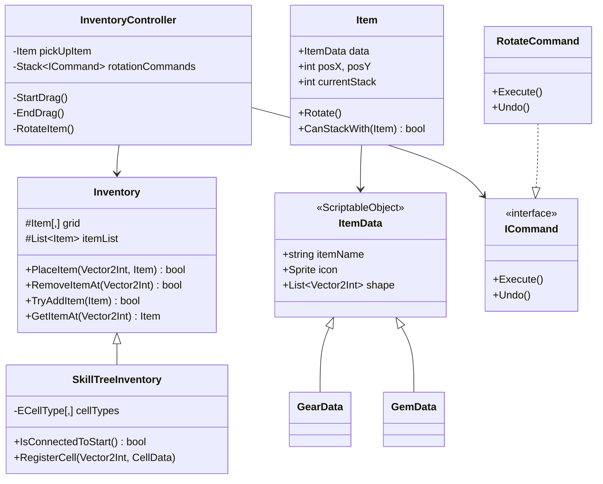
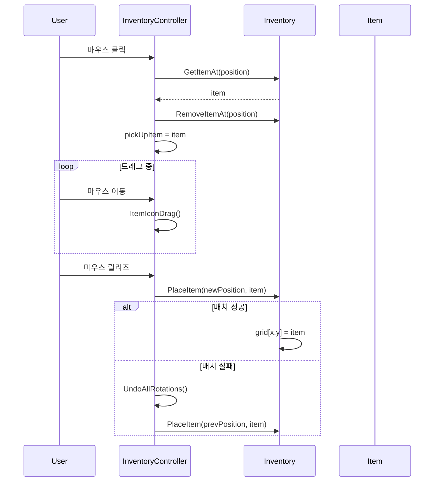
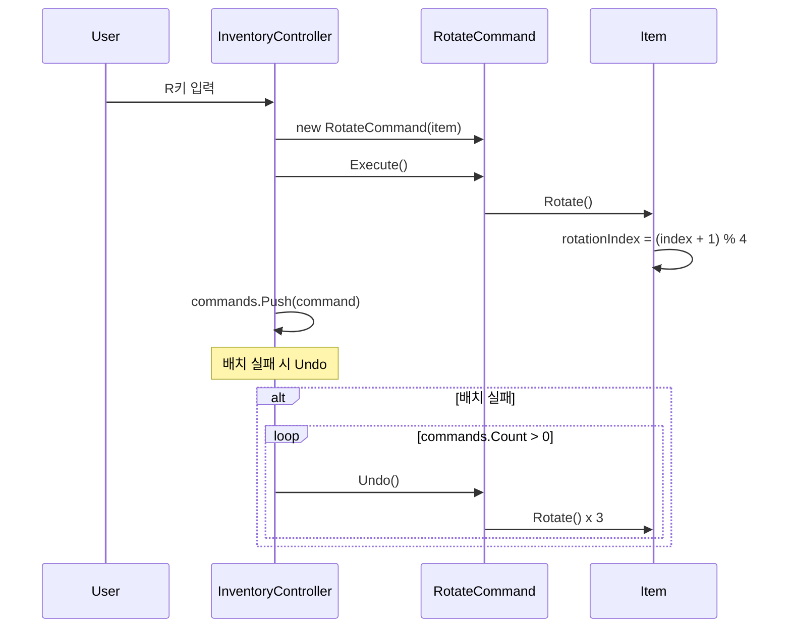

# 📦 인벤토리 & 아이템 시스템 다이어그램

## 클래스 다이어그램

```mermaid
classDiagram
    class Inventory {
        #Item[,] grid
        #List~Item~ itemList
        +PlaceItem(Vector2Int, Item) bool
        +RemoveItemAt(Vector2Int) bool
        +TryAddItem(Item) bool
        +GetItemAt(Vector2Int) Item
    }
    
    class SkillTreeInventory {
        -ECellType[,] cellTypes
        +IsConnectedToStart() bool
        +RegisterCell(Vector2Int, CellData)
    }
    
    class InventoryController {
        -Item pickUpItem
        -Stack~ICommand~ rotationCommands
        -StartDrag()
        -EndDrag()
        -RotateItem()
    }
    
    class Item {
        +ItemData data
        +int posX, posY
        +int currentStack
        +Rotate()
        +CanStackWith(Item) bool
    }
    
    class ItemData {
        <<ScriptableObject>>
        +string itemName
        +Sprite icon
        +List~Vector2Int~ shape
    }
    
    class ICommand {
        <<interface>>
        +Execute()
        +Undo()
    }
    
    class RotateCommand {
        +Execute()
        +Undo()
    }

    Inventory <|-- SkillTreeInventory
    InventoryController --> Inventory
    InventoryController --> ICommand
    RotateCommand ..|> ICommand
    Item --> ItemData
    ItemData <|-- GearData
    ItemData <|-- GemData
```

## 시퀀스 다이어그램 - 아이템 드래그 앤 드롭

```mermaid
sequenceDiagram
    participant User
    participant InventoryController
    participant Inventory
    participant Item

    User->>InventoryController: 마우스 클릭
    InventoryController->>Inventory: GetItemAt(position)
    Inventory-->>InventoryController: item
    InventoryController->>Inventory: RemoveItemAt(position)
    InventoryController->>InventoryController: pickUpItem = item
    
    loop 드래그 중
        User->>InventoryController: 마우스 이동
        InventoryController->>InventoryController: ItemIconDrag()
    end
    
    User->>InventoryController: 마우스 릴리즈
    InventoryController->>Inventory: PlaceItem(newPosition, item)
    
    alt 배치 성공
        Inventory->>Inventory: grid[x,y] = item
    else 배치 실패
        InventoryController->>InventoryController: UndoAllRotations()
        InventoryController->>Inventory: PlaceItem(prevPosition, item)
    end
```

## 시퀀스 다이어그램 - 아이템 회전 (Command 패턴)

```mermaid
sequenceDiagram
    participant User
    participant InventoryController
    participant RotateCommand
    participant Item

    User->>InventoryController: R키 입력
    InventoryController->>RotateCommand: new RotateCommand(item)
    InventoryController->>RotateCommand: Execute()
    RotateCommand->>Item: Rotate()
    Item->>Item: rotationIndex = (index + 1) % 4
    InventoryController->>InventoryController: commands.Push(command)
    
    Note over InventoryController: 배치 실패 시 Undo
    alt 배치 실패
        loop commands.Count > 0
            InventoryController->>RotateCommand: Undo()
            RotateCommand->>Item: Rotate() x 3
        end
    end
```
