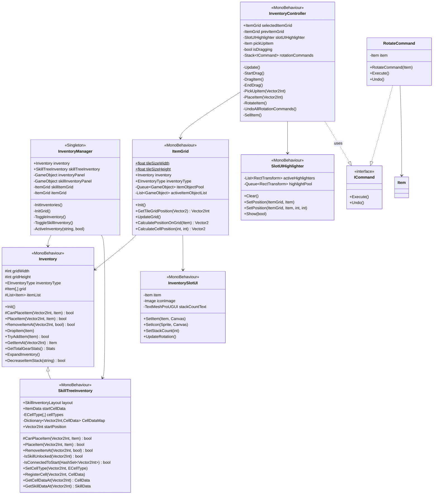
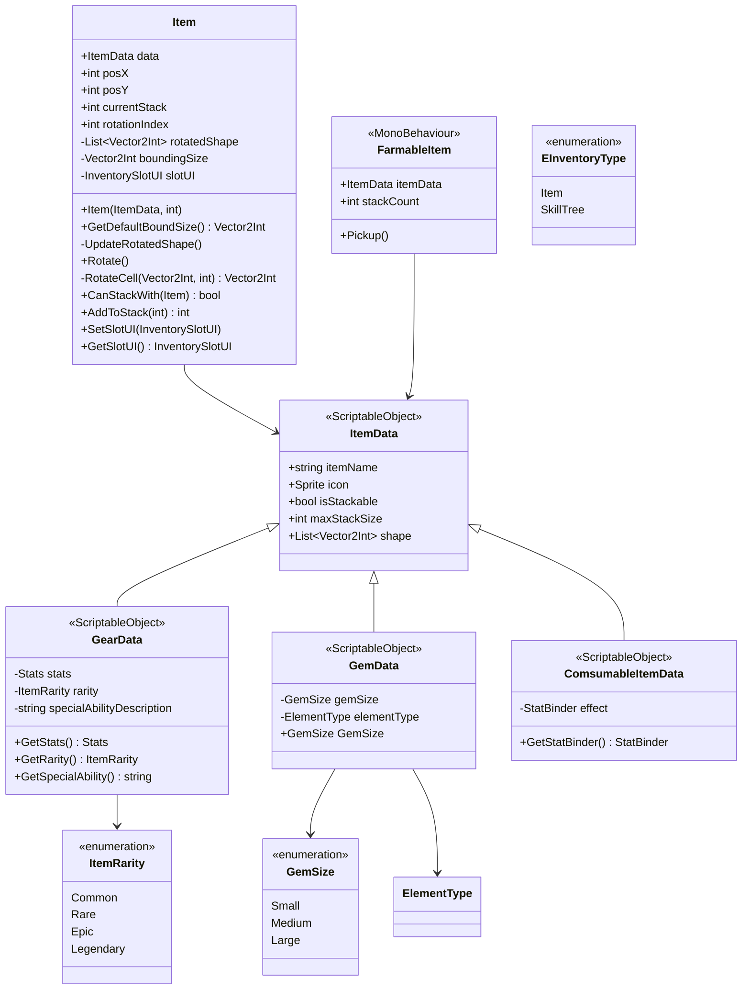
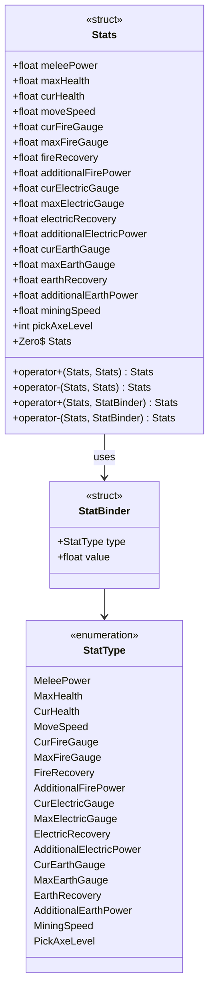
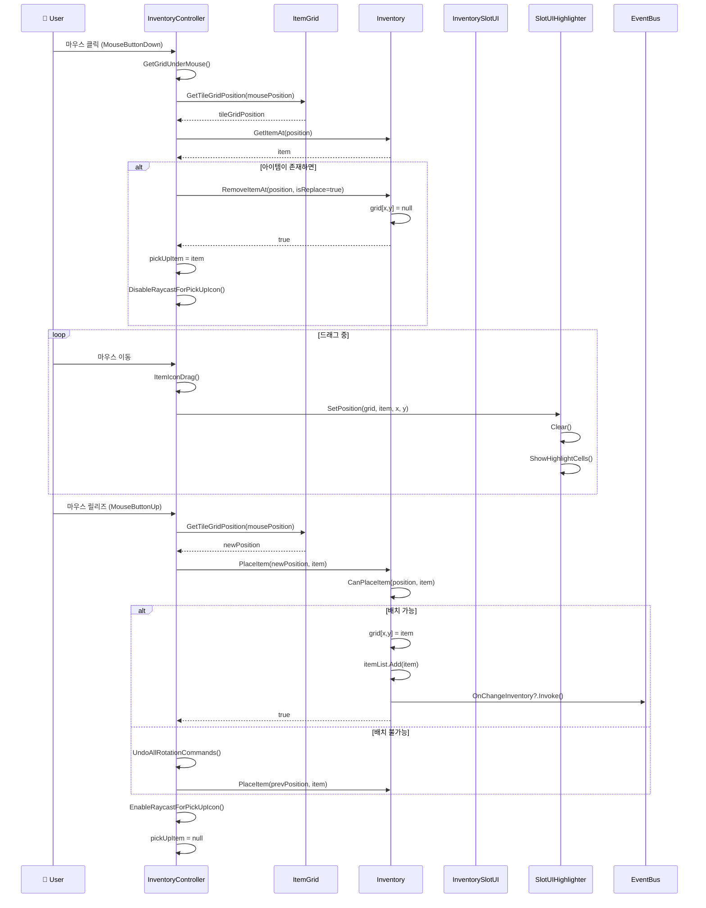
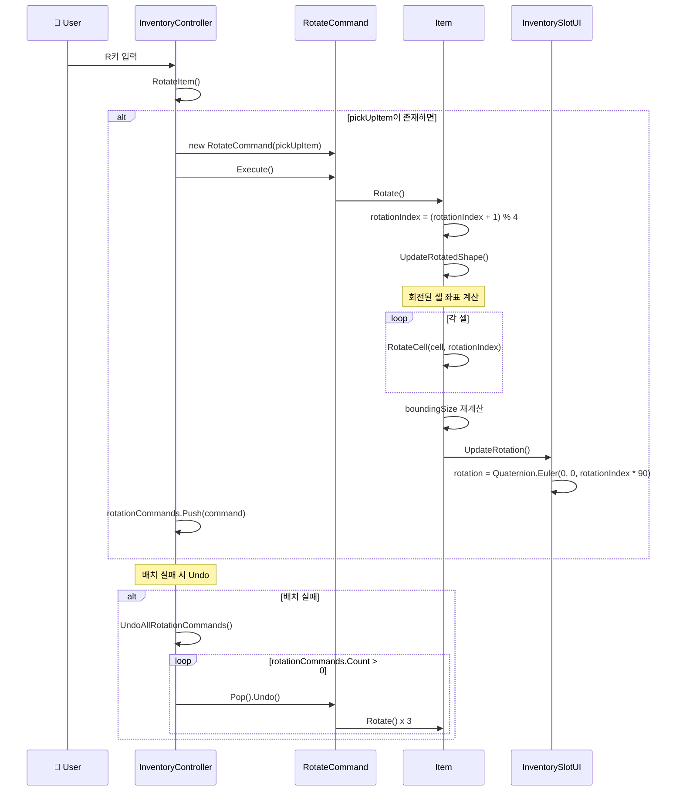
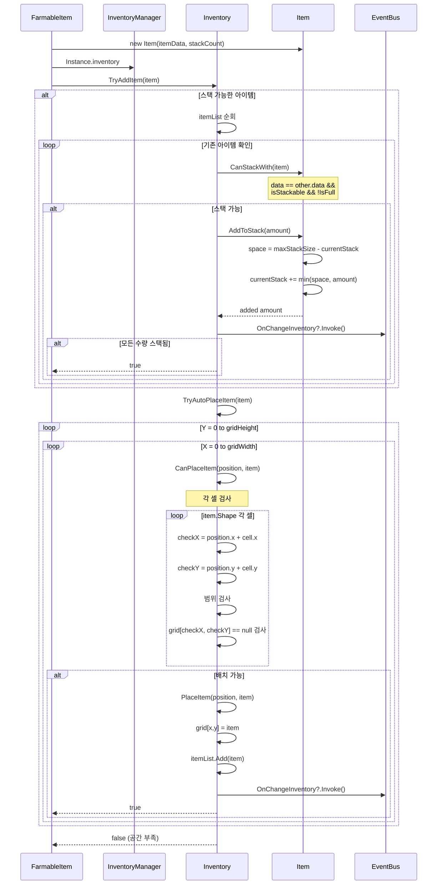
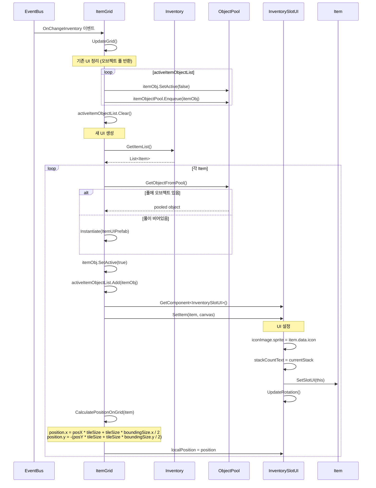

# 📦 인벤토리 & 아이템 시스템 다이어그램

## 목차
1. [인벤토리 시스템 클래스 다이어그램](#1-인벤토리-시스템-클래스-다이어그램)
2. [아이템 시스템 클래스 다이어그램](#2-아이템-시스템-클래스-다이어그램)
3. [스탯 시스템 클래스 다이어그램](#3-스탯-시스템-클래스-다이어그램)
4. [아이템 드래그 앤 드롭 시퀀스](#4-아이템-드래그-앤-드롭-시퀀스)
5. [아이템 회전 시퀀스](#5-아이템-회전-시퀀스)
6. [아이템 자동 배치 시퀀스](#6-아이템-자동-배치-시퀀스)
7. [인벤토리 UI 업데이트 시퀀스](#7-인벤토리-ui-업데이트-시퀀스)

---

## 1. 인벤토리 시스템 클래스 다이어그램

그리드 기반 인벤토리 시스템의 핵심 클래스 구조입니다. `Inventory` 클래스를 기반으로 `SkillTreeInventory`가 상속받아 스킬 해금 로직을 추가합니다.

---

## 2. 아이템 시스템 클래스 다이어그램

아이템 데이터 및 인스턴스 구조입니다. ScriptableObject 기반의 `ItemData`에서 다양한 아이템 타입으로 상속됩니다.

---

## 3. 스탯 시스템 클래스 다이어그램

캐릭터 스탯 및 아이템/스킬 효과에 사용되는 스탯 구조체입니다.

---

## 4. 아이템 드래그 앤 드롭 시퀀스

인벤토리에서 아이템을 드래그하여 이동시키는 전체 흐름입니다.

---

## 5. 아이템 회전 시퀀스

테트리스 스타일로 아이템을 회전시키는 흐름입니다. Command 패턴을 사용하여 Undo가 가능합니다.

---

## 6. 아이템 자동 배치 시퀀스

아이템 획득 시 인벤토리의 빈 공간을 찾아 자동으로 배치하는 흐름입니다.

---

## 7. 인벤토리 UI 업데이트 시퀀스

인벤토리 변경 시 오브젝트 풀을 활용하여 UI를 효율적으로 업데이트하는 흐름입니다.

