# 🔄 시퀀스 다이어그램

## 1. 인벤토리 아이템 배치 시퀀스

### 1.1 아이템 드래그 앤 드롭

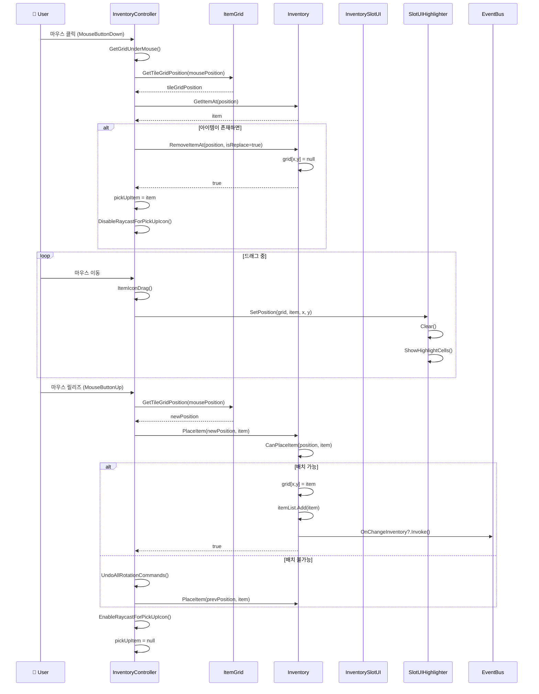

### 1.2 아이템 회전

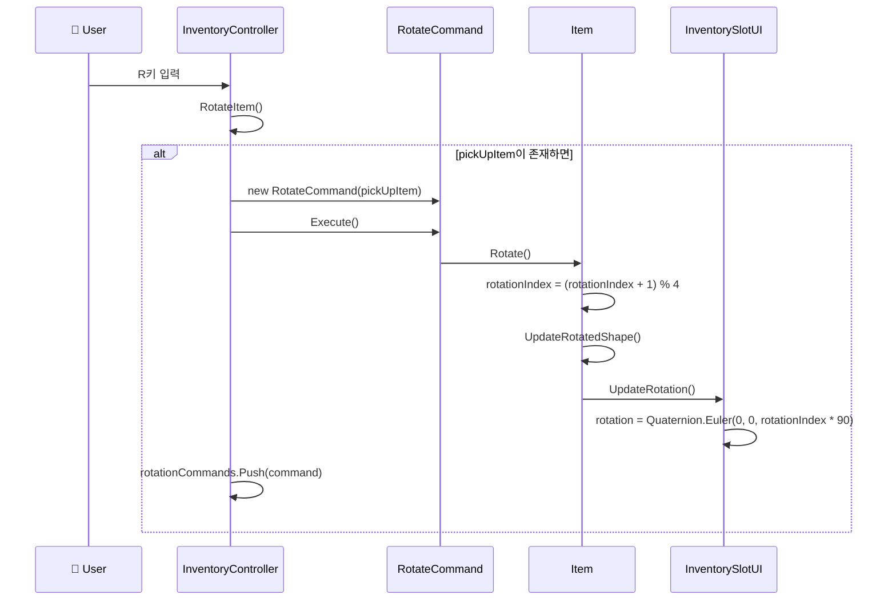

### 1.3 아이템 자동 배치 (획득 시)

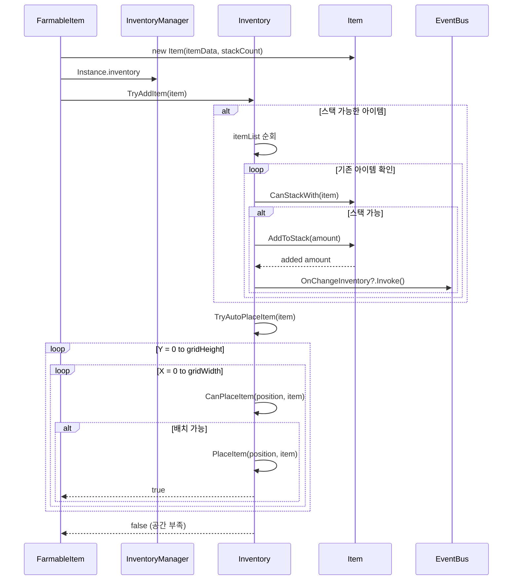

## 2. 스킬 사용 시퀀스

### 2.1 즉발형 스킬 사용

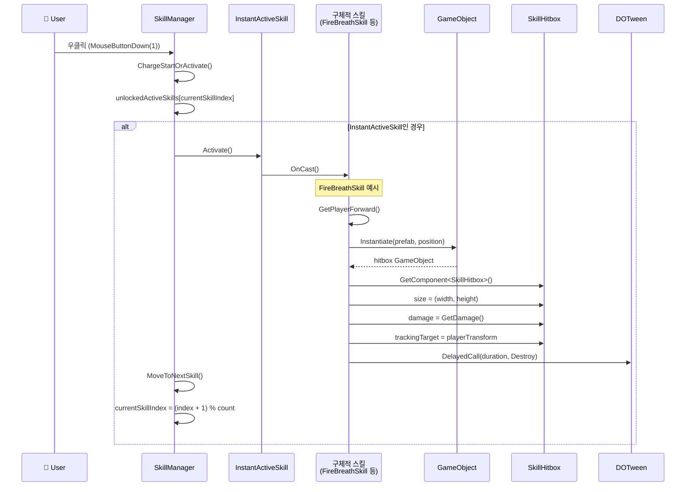

### 2.2 차징형 스킬 사용

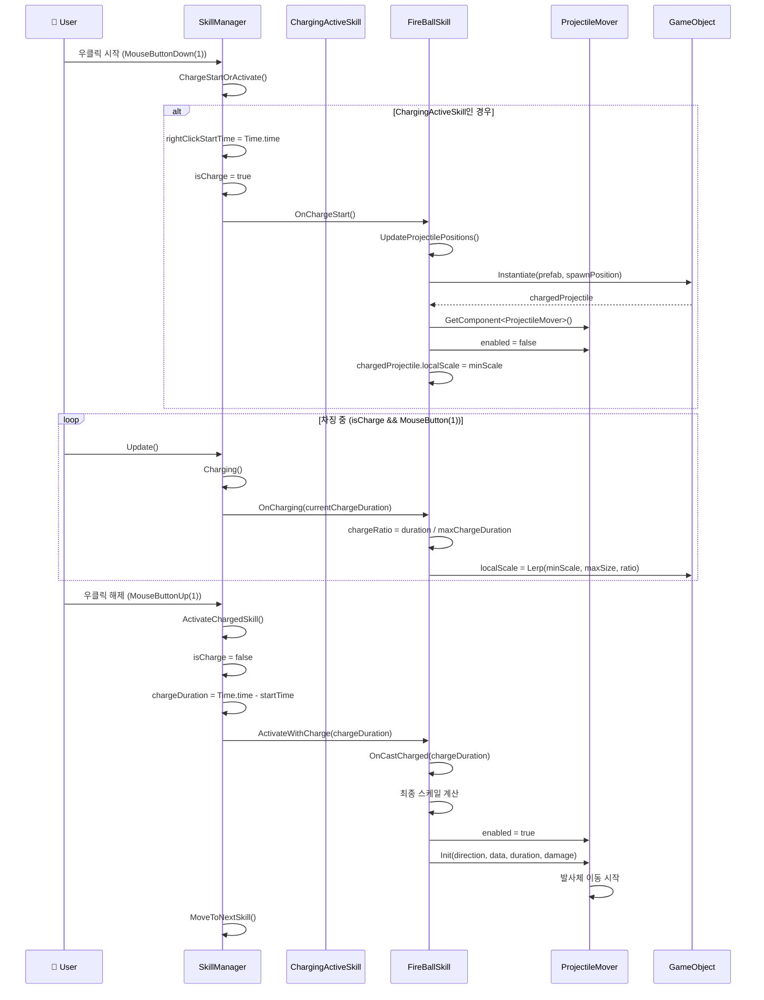

### 2.3 대쉬 스킬 (ElectricRushSkill)

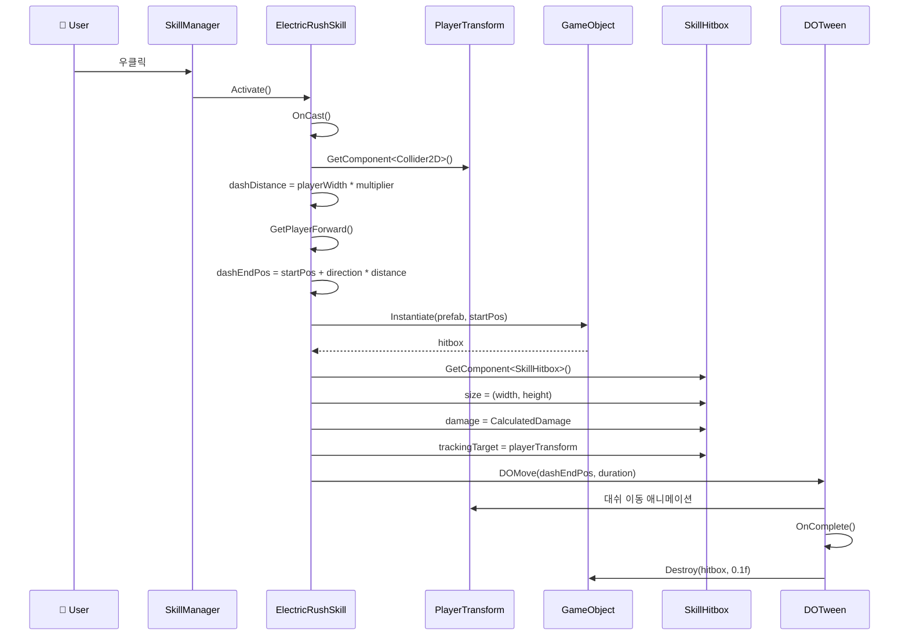

## 3. 스킬 해금 시퀀스

### 3.1 스킬 트리에서 스킬 해금

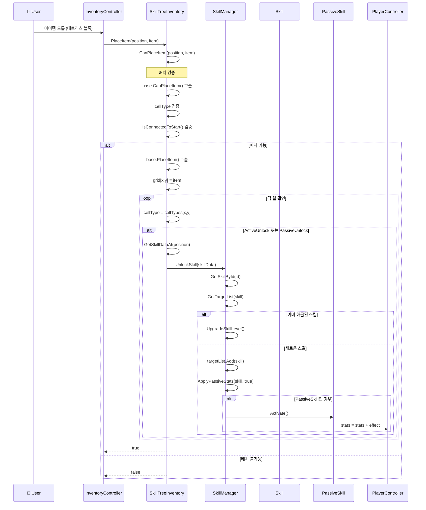

### 3.2 스킬 잠금 (블록 제거)

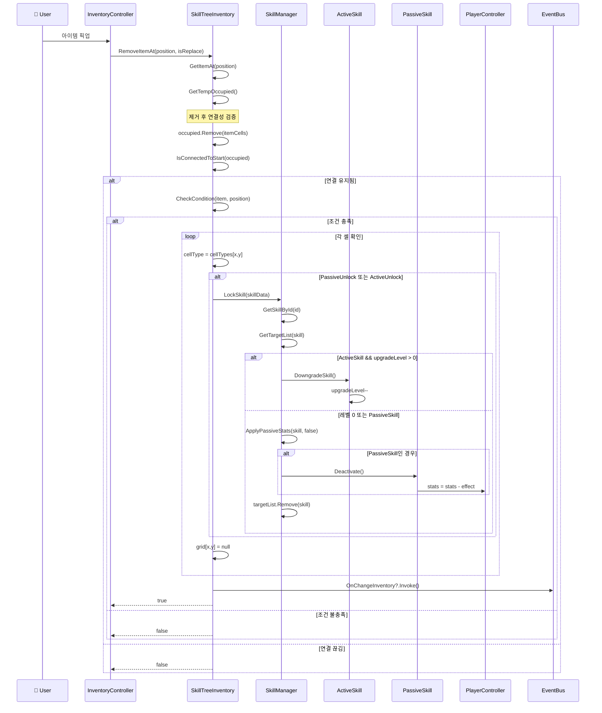

## 4. 스킬 데이터 로딩 시퀀스

### 4.1 게임 시작 시 스킬 로딩

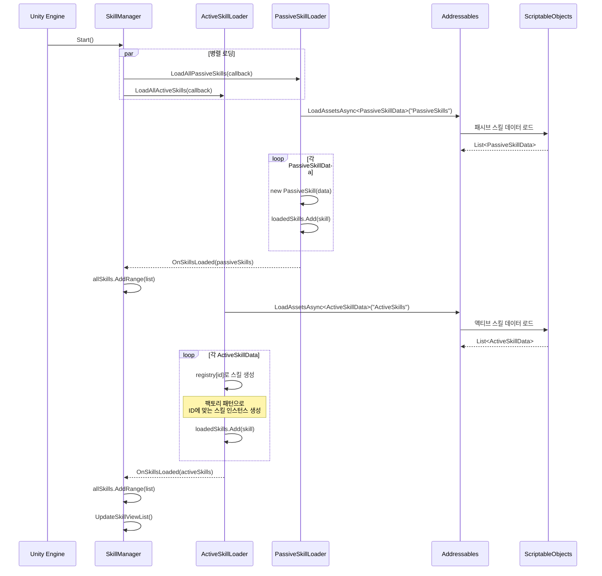

## 5. 인벤토리 UI 업데이트 시퀀스

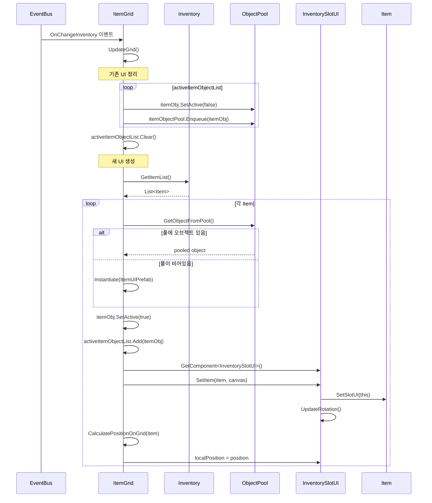

## 6. 투사체 동작 시퀀스

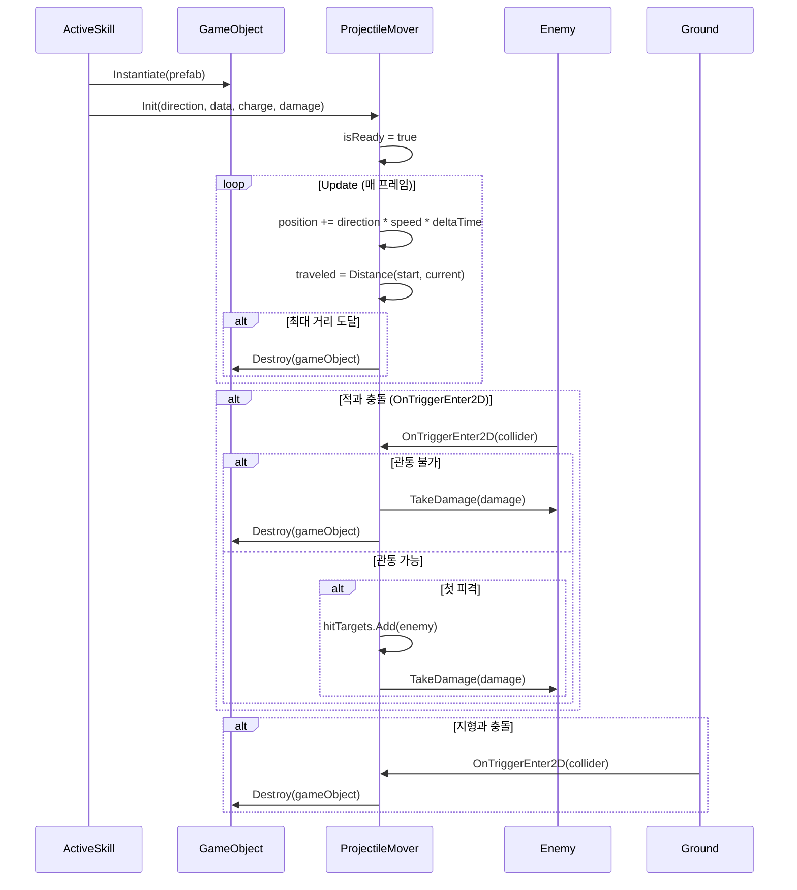
