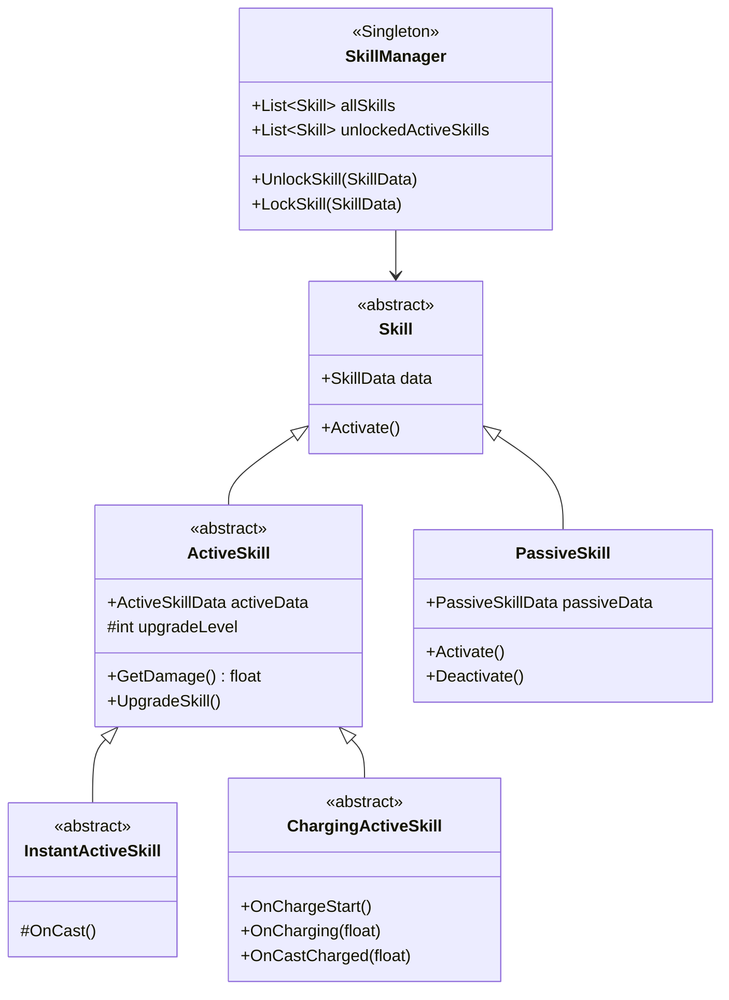
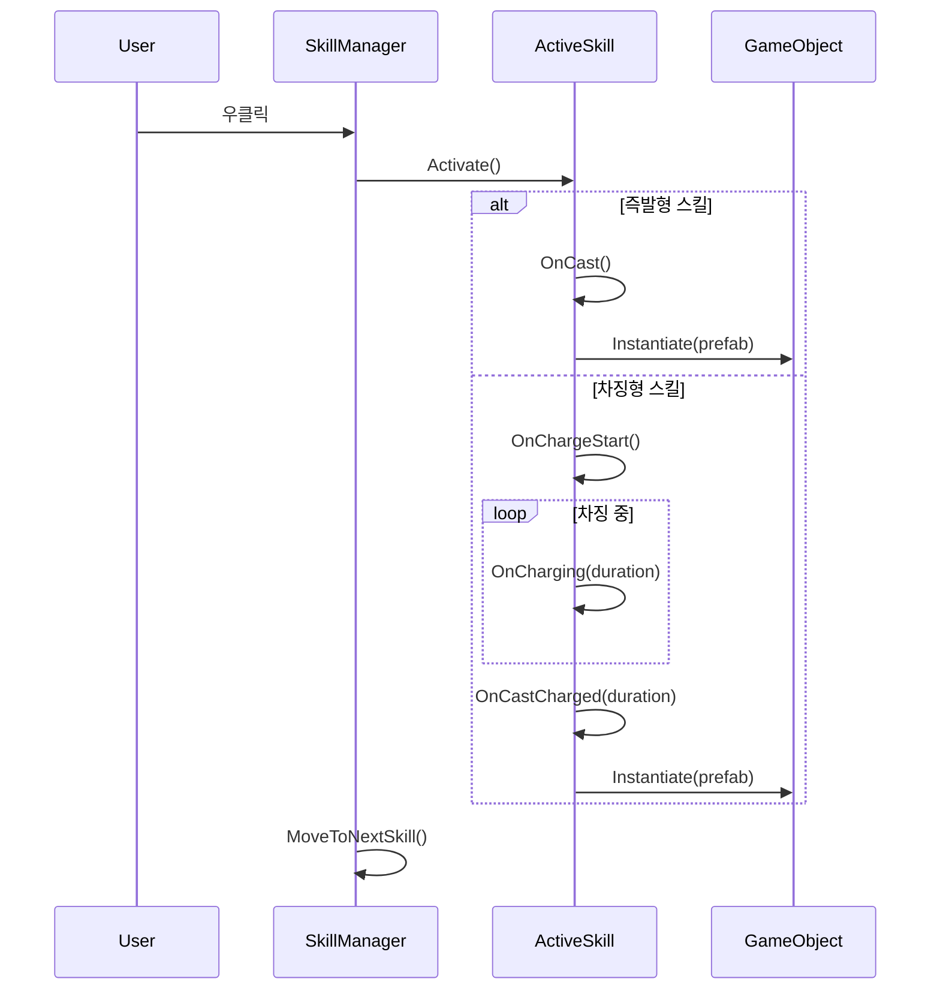
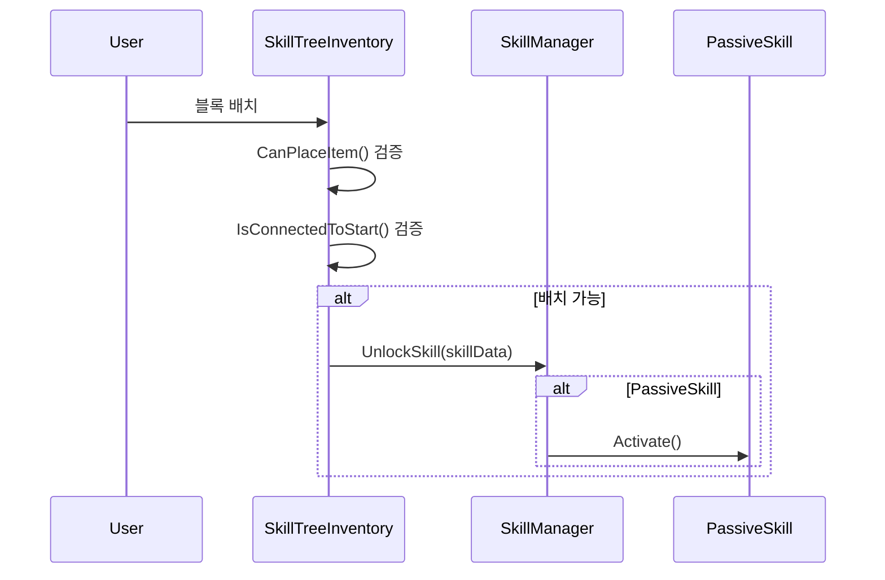

# ⚡ 스킬 시스템 다이어그램

## 클래스 다이어그램

```mermaid
classDiagram
    class Skill {
        <<abstract>>
        +SkillData data
        +Activate()
    }
    
    class ActiveSkill {
        <<abstract>>
        +ActiveSkillData activeData
        #int upgradeLevel
        +GetDamage() float
        +UpgradeSkill()
    }
    
    class PassiveSkill {
        +PassiveSkillData passiveData
        +Activate()
        +Deactivate()
    }
    
    class InstantActiveSkill {
        <<abstract>>
        #OnCast()
    }
    
    class ChargingActiveSkill {
        <<abstract>>
        +OnChargeStart()
        +OnCharging(float)
        +OnCastCharged(float)
    }
    
    class SkillManager {
        <<Singleton>>
        +List~Skill~ allSkills
        +List~Skill~ unlockedActiveSkills
        +UnlockSkill(SkillData)
        +LockSkill(SkillData)
    }

    Skill <|-- ActiveSkill
    Skill <|-- PassiveSkill
    ActiveSkill <|-- InstantActiveSkill
    ActiveSkill <|-- ChargingActiveSkill
    SkillManager --> Skill
```

## 시퀀스 다이어그램 - 스킬 사용

```mermaid
sequenceDiagram
    participant User
    participant SkillManager
    participant ActiveSkill
    participant GameObject

    User->>SkillManager: 우클릭
    SkillManager->>ActiveSkill: Activate()
    
    alt 즉발형 스킬
        ActiveSkill->>ActiveSkill: OnCast()
        ActiveSkill->>GameObject: Instantiate(prefab)
    else 차징형 스킬
        ActiveSkill->>ActiveSkill: OnChargeStart()
        loop 차징 중
            ActiveSkill->>ActiveSkill: OnCharging(duration)
        end
        ActiveSkill->>ActiveSkill: OnCastCharged(duration)
        ActiveSkill->>GameObject: Instantiate(prefab)
    end
    
    SkillManager->>SkillManager: MoveToNextSkill()
```

## 시퀀스 다이어그램 - 스킬 해금

```mermaid
sequenceDiagram
    participant User
    participant SkillTreeInventory
    participant SkillManager
    participant PassiveSkill

    User->>SkillTreeInventory: 블록 배치
    SkillTreeInventory->>SkillTreeInventory: CanPlaceItem() 검증
    SkillTreeInventory->>SkillTreeInventory: IsConnectedToStart() 검증
    
    alt 배치 가능
        SkillTreeInventory->>SkillManager: UnlockSkill(skillData)
        alt PassiveSkill
            SkillManager->>PassiveSkill: Activate()
        end
    end
```
