# ⚡ 스킬 시스템 다이어그램

## 목차
1. [스킬 클래스 다이어그램](#1-스킬-클래스-다이어그램)
2. [스킬 데이터 클래스 다이어그램](#2-스킬-데이터-클래스-다이어그램)
3. [스킬 유틸리티 클래스 다이어그램](#3-스킬-유틸리티-클래스-다이어그램)
4. [스킬 인벤토리 클래스 다이어그램](#4-스킬-인벤토리-클래스-다이어그램)
5. [즉발형 스킬 사용 시퀀스](#5-즉발형-스킬-사용-시퀀스)
6. [차징형 스킬 사용 시퀀스](#6-차징형-스킬-사용-시퀀스)
7. [대쉬 스킬 시퀀스](#7-대쉬-스킬-시퀀스)
8. [스킬 해금 시퀀스](#8-스킬-해금-시퀀스)
9. [스킬 잠금 시퀀스](#9-스킬-잠금-시퀀스)
10. [스킬 데이터 로딩 시퀀스](#10-스킬-데이터-로딩-시퀀스)
11. [투사체 동작 시퀀스](#11-투사체-동작-시퀀스)

---

## 1. 스킬 클래스 다이어그램

스킬 시스템의 핵심 클래스 구조입니다. 추상 클래스 `Skill`을 기반으로 `ActiveSkill`과 `PassiveSkill`로 분기되며, 액티브 스킬은 다시 `InstantActiveSkill`(즉발형)과 `ChargingActiveSkill`(차징형)으로 나뉩니다.

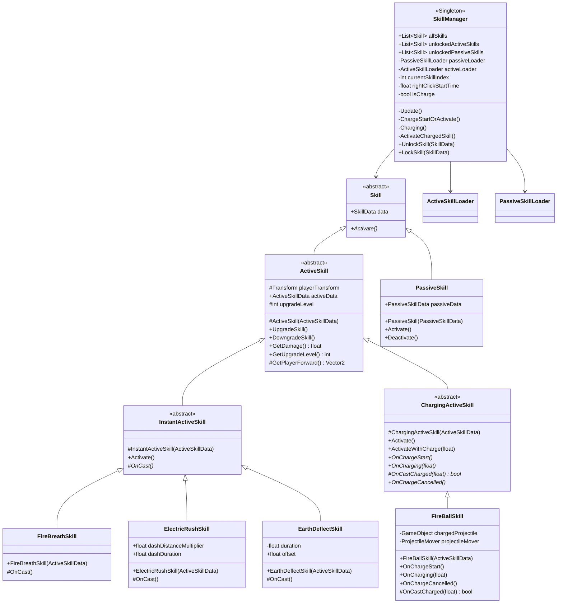

---

## 2. 스킬 데이터 클래스 다이어그램

ScriptableObject 기반의 스킬 데이터 구조입니다. 기본 `SkillData`에서 `ActiveSkillData`와 `PassiveSkillData`로 상속됩니다.

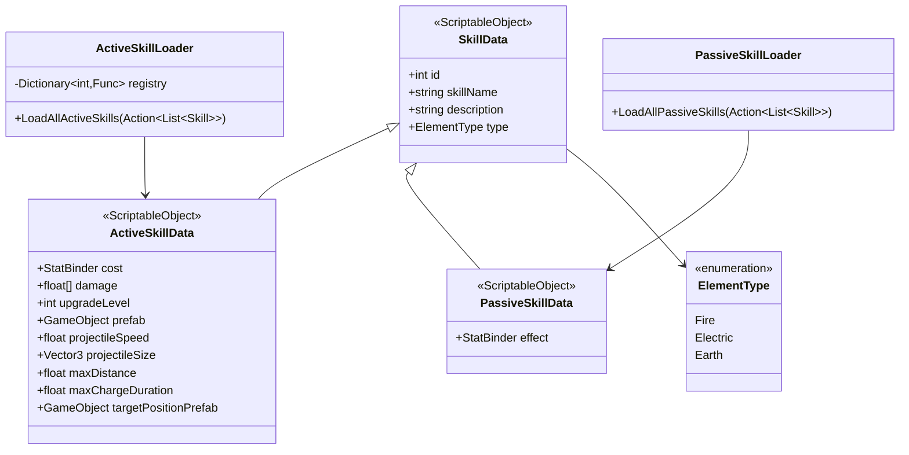

---

## 3. 스킬 유틸리티 클래스 다이어그램

스킬 실행에 필요한 유틸리티 클래스들입니다. 투사체 이동, 히트박스 처리, 데미지 계산 등을 담당합니다.

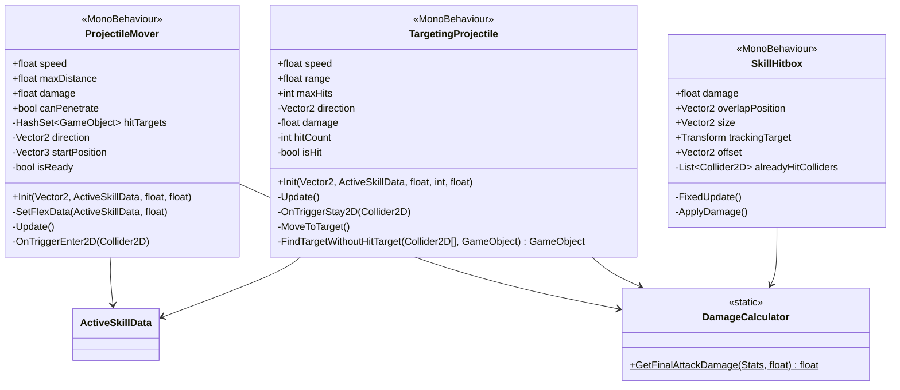

---

## 4. 스킬 인벤토리 클래스 다이어그램

스킬 트리 인벤토리 관련 클래스입니다. 그리드 기반으로 스킬을 배치하고 해금하는 시스템입니다.

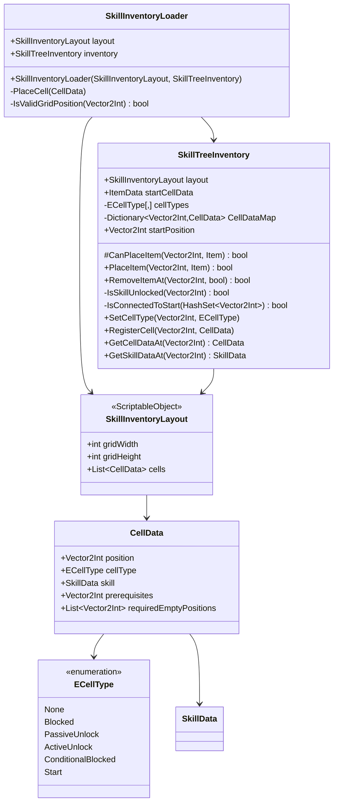

---

## 5. 즉발형 스킬 사용 시퀀스

버튼 클릭 시 즉시 발동되는 즉발형 스킬의 실행 흐름입니다.

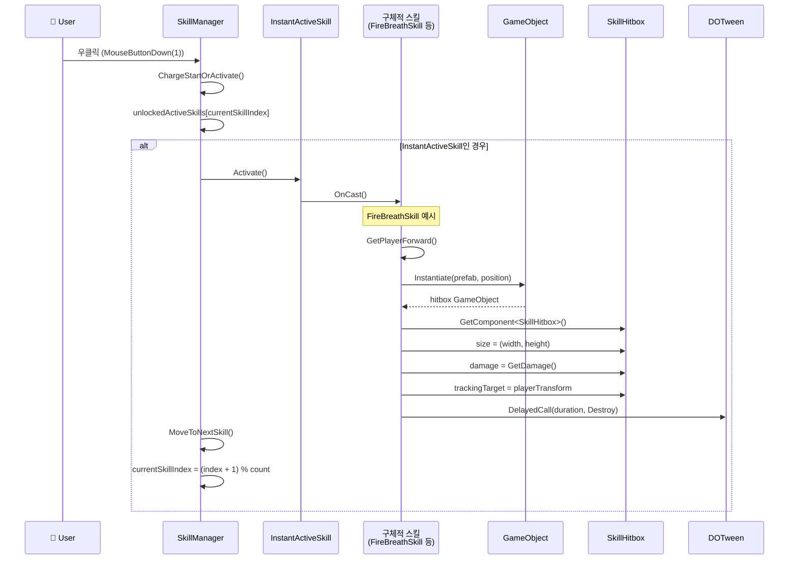

---

## 6. 차징형 스킬 사용 시퀀스

버튼을 누르고 있는 동안 차징되고, 놓으면 발동되는 차징형 스킬의 실행 흐름입니다.

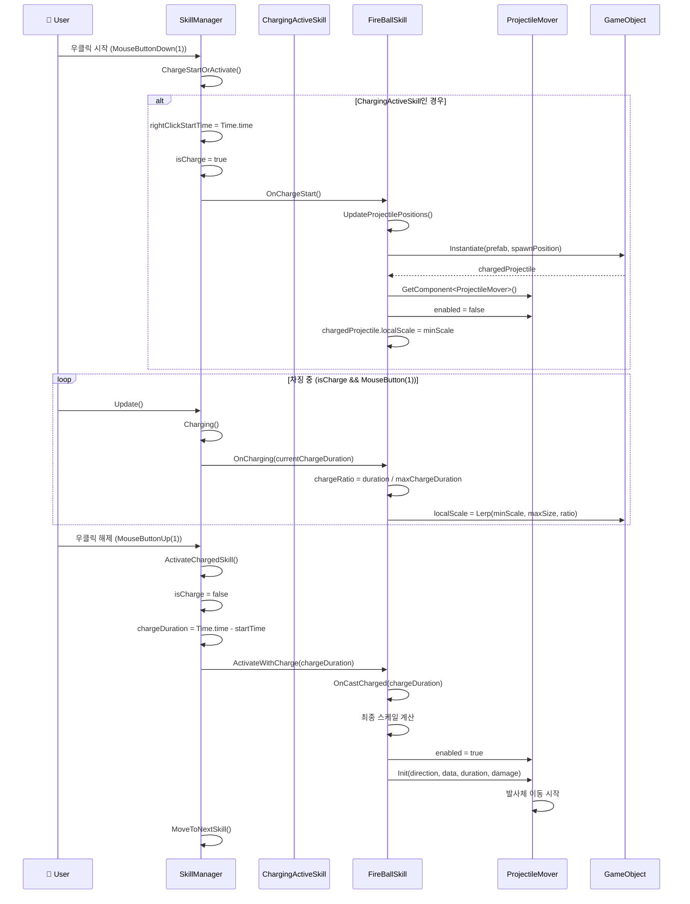

---

## 7. 대쉬 스킬 시퀀스

ElectricRushSkill과 같은 대쉬 스킬의 실행 흐름입니다. DOTween을 사용하여 플레이어를 이동시킵니다.

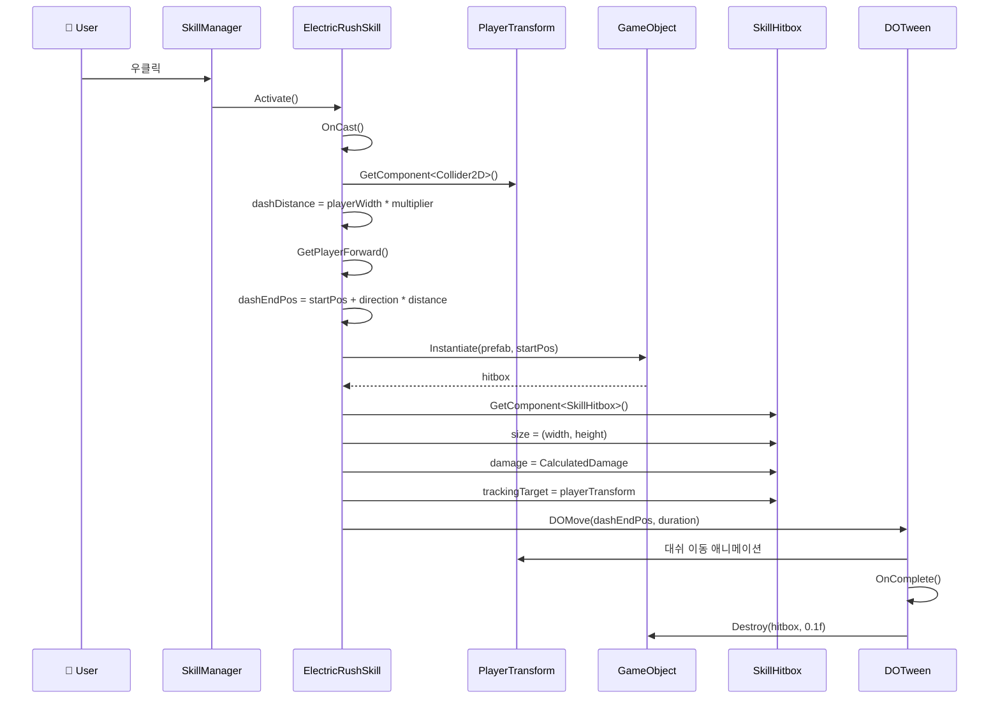

---

## 8. 스킬 해금 시퀀스

스킬 트리 인벤토리에서 블록을 배치하여 스킬을 해금하는 흐름입니다.

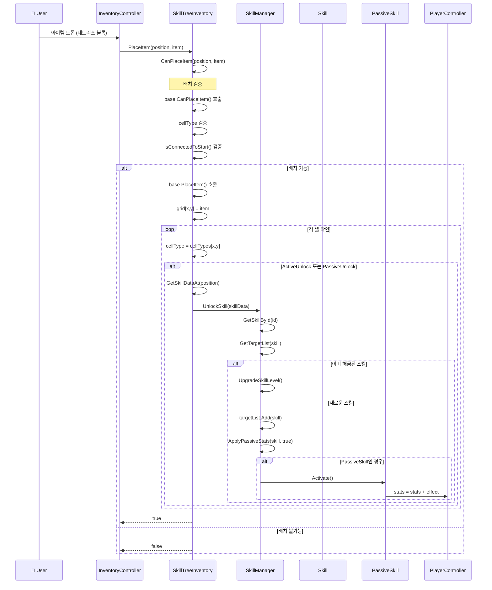

---

## 9. 스킬 잠금 시퀀스

스킬 트리에서 블록을 제거할 때 스킬을 잠금 처리하는 흐름입니다.

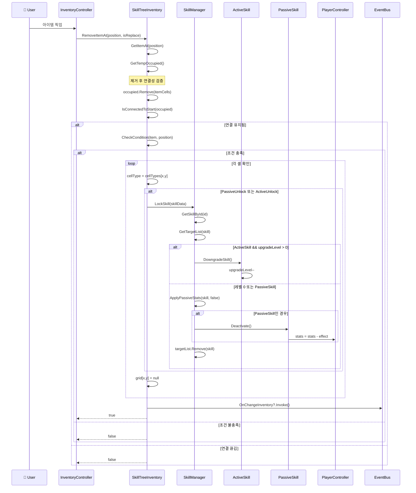

---

## 10. 스킬 데이터 로딩 시퀀스

게임 시작 시 Addressables를 통해 스킬 데이터를 비동기 로딩하는 흐름입니다.

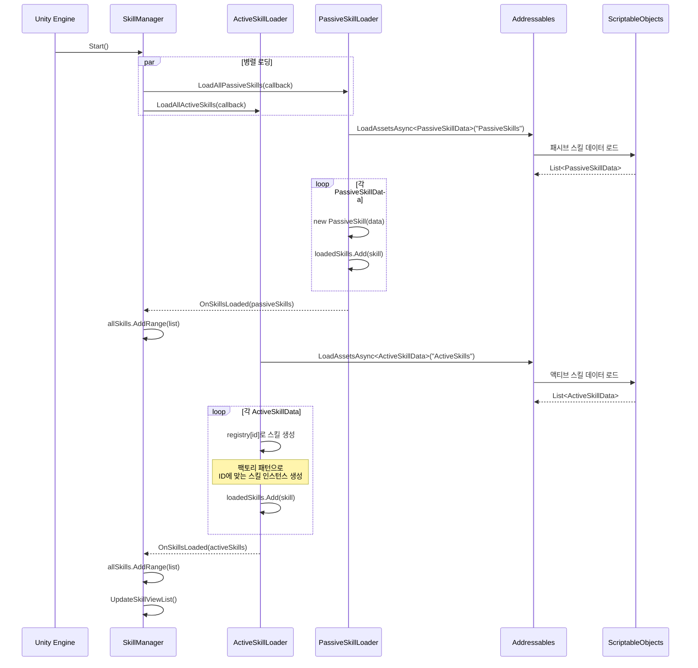

---

## 11. 투사체 동작 시퀀스

투사체(Projectile)가 생성되고 이동하며 충돌 처리하는 흐름입니다.

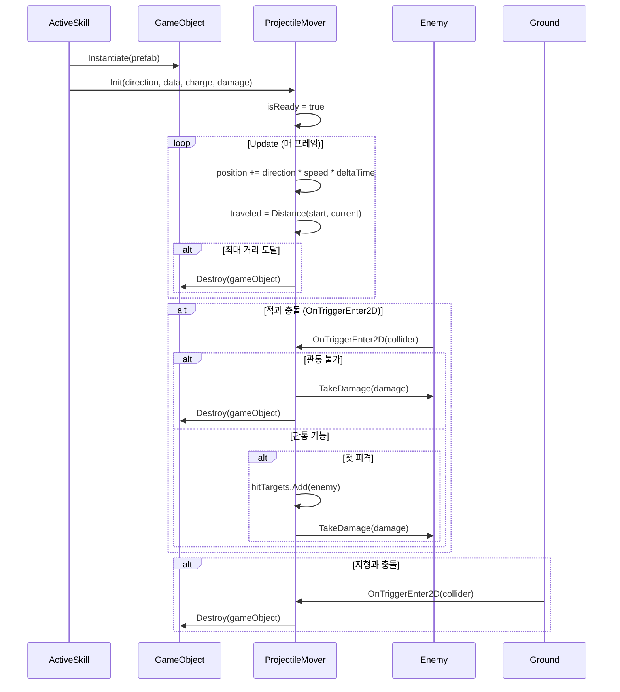
