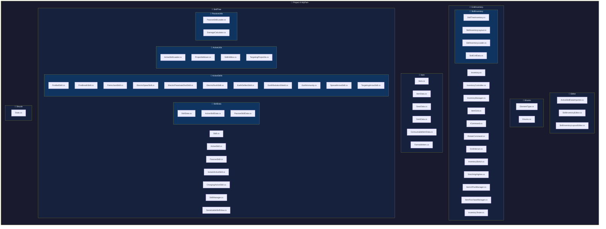
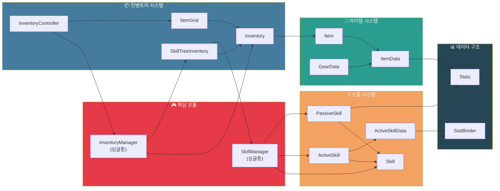
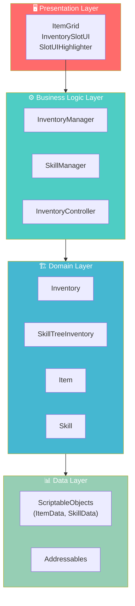

# 📁 프로젝트 구조 다이어그램

## 폴더 구조 다이어그램

```mermaid
graph TB
    subgraph Root["📁 Project-X-MyPart-"]
        direction TB
        
        subgraph Editor["📁 Editor"]
            E1["ActiveSkillDataImporter.cs"]
            E2["SkillInventoryEditor.cs"]
            E3["SkillInventoryLayoutEditor.cs"]
        end
        
        subgraph Enums["📁 Enums"]
            EN1["ElementType.cs"]
            EN2["Enums.cs"]
        end
        
        subgraph GridInventory["📁 GridInventory"]
            GI1["Inventory.cs"]
            GI2["InventoryController.cs"]
            GI3["InventoryManager.cs"]
            GI4["ItemGrid.cs"]
            GI5["ICommand.cs"]
            GI6["RotateCommand.cs"]
            GI7["GridInteract.cs"]
            GI8["InventorySlotUI.cs"]
            GI9["SlotUIHighlighter.cs"]
            GI10["ItemUIPoolManager.cs"]
            GI11["ItemPurchaseManager.cs"]
            GI12["InventoryTester.cs"]
            
            subgraph SkillInventory["📁 SkillInventory"]
                SI1["SkillTreeInventory.cs"]
                SI2["SkillInventoryLayout.cs"]
                SI3["SkillInventoryLoader.cs"]
                SI4["SkillCellData.cs"]
            end
        end
        
        subgraph Item["📁 Item"]
            IT1["Item.cs"]
            IT2["ItemData.cs"]
            IT3["GearData.cs"]
            IT4["GemData.cs"]
            IT5["ComsumableItemData.cs"]
            IT6["FarmableItem.cs"]
        end
        
        subgraph SkillTree["📁 SkillTree"]
            ST1["Skill.cs"]
            ST2["ActiveSkill.cs"]
            ST3["PassiveSkill.cs"]
            ST4["InstantActiveSkill.cs"]
            ST5["ChargingActiveSkill.cs"]
            ST6["SkillManager.cs"]
            ST7["SerializableSkillView.cs"]
            
            subgraph SkillData["📁 SkillData"]
                SD1["SkillData.cs"]
                SD2["ActiveSkillData.cs"]
                SD3["PassiveSkillData.cs"]
            end
            
            subgraph ActiveSkills["📁 ActiveSkills"]
                AS1["FireBallSkill.cs"]
                AS2["FireBreathSkill.cs"]
                AS3["FireInchantSkill.cs"]
                AS4["ElectricSpearSkill.cs"]
                AS5["ElectricPenetrateShotSkill.cs"]
                AS6["ElectricRushSkill.cs"]
                AS7["EarthDeflectSkill.cs"]
                AS8["EarthRedutionShield.cs"]
                AS9["EarthImmunity.cs"]
                AS10["SpreadArrowSkill.cs"]
                AS11["TargetingArrowSkill.cs"]
            end
            
            subgraph ActiveUtils["📁 ActiveUtils"]
                AU1["ActiveSkillLoader.cs"]
                AU2["ProjectileMover.cs"]
                AU3["SkillHitBox.cs"]
                AU4["TargetingProjectile.cs"]
            end
            
            subgraph PassiveUtils["📁 PassiveUtils"]
                PU1["PassiveSkillLoader.cs"]
                PU2["DamageCalculator.cs"]
            end
        end
        
        subgraph Structs["📁 Structs"]
            STR1["Stats.cs"]
        end
    end

    style Root fill:#1a1a2e,color:#fff
    style Editor fill:#16213e,color:#fff
    style Enums fill:#16213e,color:#fff
    style GridInventory fill:#16213e,color:#fff
    style SkillInventory fill:#0f3460,color:#fff
    style Item fill:#16213e,color:#fff
    style SkillTree fill:#16213e,color:#fff
    style SkillData fill:#0f3460,color:#fff
    style ActiveSkills fill:#0f3460,color:#fff
    style ActiveUtils fill:#0f3460,color:#fff
    style PassiveUtils fill:#0f3460,color:#fff
    style Structs fill:#16213e,color:#fff
```

## 모듈 의존성 다이어그램

```mermaid
graph LR
    subgraph Core["🎮 핵심 모듈"]
        IM["InventoryManager<br/>(싱글톤)"]
        SM["SkillManager<br/>(싱글톤)"]
    end
    
    subgraph Inventory["📦 인벤토리 시스템"]
        INV["Inventory"]
        STI["SkillTreeInventory"]
        IC["InventoryController"]
        IG["ItemGrid"]
    end
    
    subgraph Item["🎁 아이템 시스템"]
        IT["Item"]
        ID["ItemData"]
        GD["GearData"]
    end
    
    subgraph Skill["⚡ 스킬 시스템"]
        SK["Skill"]
        AS["ActiveSkill"]
        PS["PassiveSkill"]
        ASD["ActiveSkillData"]
    end
    
    subgraph Data["📊 데이터 구조"]
        ST["Stats"]
        SB["StatBinder"]
    end
    
    IM --> INV
    IM --> STI
    SM --> SK
    SM --> AS
    SM --> PS
    
    INV --> IT
    STI --> INV
    STI --> SM
    
    IC --> IM
    IC --> IG
    IG --> INV
    
    IT --> ID
    GD --> ID
    
    AS --> SK
    PS --> SK
    AS --> ASD
    PS --> ST
    
    ID --> ST
    ASD --> SB
    
    style Core fill:#e63946,color:#fff
    style Inventory fill:#457b9d,color:#fff
    style Item fill:#2a9d8f,color:#fff
    style Skill fill:#f4a261,color:#fff
    style Data fill:#264653,color:#fff
```

## 시스템 아키텍처

```mermaid
graph TB
    subgraph Presentation["🖥️ Presentation Layer"]
        UI["ItemGrid<br/>InventorySlotUI<br/>SlotUIHighlighter"]
    end
    
    subgraph Business["⚙️ Business Logic Layer"]
        IM["InventoryManager"]
        SM["SkillManager"]
        IC["InventoryController"]
    end
    
    subgraph Domain["🏗️ Domain Layer"]
        INV["Inventory"]
        STI["SkillTreeInventory"]
        IT["Item"]
        SK["Skill"]
    end
    
    subgraph Data["📊 Data Layer"]
        SO["ScriptableObjects<br/>(ItemData, SkillData)"]
        ADDR["Addressables"]
    end
    
    UI --> Business
    Business --> Domain
    Domain --> Data
    
    style Presentation fill:#ff6b6b,color:#fff
    style Business fill:#4ecdc4,color:#fff
    style Domain fill:#45b7d1,color:#fff
    style Data fill:#96ceb4,color:#fff
```
